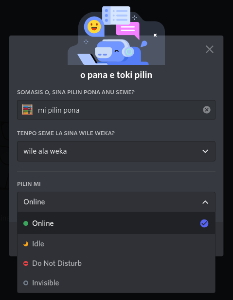
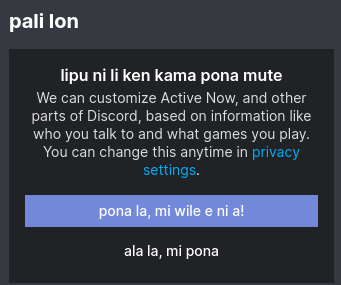

= discord-tokipona

:lang:              en-US
:url-replugged:     https://github.com/replugged-org/replugged
:url-datamining:    https://github.com/Discord-Datamining/Discord-Datamining/blob/master/current.js
:url-sil:           https://iso639-3.sil.org/request/2021-043
:url-mapali:        https://discord.gg/PrVVDEDanU

xref:README.adoc[o lukin e lipu ni lon toki pona].

A work-in-progress {url-replugged}[Replugged] plugin to translate Discord into Toki Pona.

The original strings are currently gathered from strings present in Discord-Datamining’s
{url-datamining}[current.js]. The strings used in this translation in `mama_pi_ante_toki.json`.
The strings in `mama_pi_ante_toki.json` should be consistent in meaning with the ones in this
translation; they will only be updated only when the translations are updated to match them.

== Usage

Clone this repository into your Replugged plugins directory (it can be opened from the plugin
manager in the client).

.Unix-like systems
[literal]
$ cd "${XDG_DATA_HOME:-$HOME/.local/share}"/replugged/plugins
$ git clone https://git.mutiny.red/somasis/discord-tokipona
# -or-
$ git clone https://github.com/somasis/discord-tokipona

Then load missing plugins in Replugged, or restart it, if it's running.

Make sure the plugin is enabled in the plugin section of Replugged's settings.

Then, the translation should apply.

For now you’ll need to use either `en-GB` or `en-US` as your client’s language to have strings
apply, since this plugin overrides them.

== Dialect and Phrasing Choices

* Mentions are "toki wile".
  Messages of desire, or desirious messages, because ultimately a mention is a message sent for
  want of the person who is being mentioned.
* Notifications are "kama toki".
  They are things that bring about knowledge of message-arrivals to you.
* Number representation.
  This translation uses words for numbers 0 through 10, and any larger simply displaying
  numeric amounts.
  The number system used tries to be very neutral: pu extended.
  ala (0), wan (1), tu (2), tu wan (3), tu tu (4), luka (5), luka wan (6), luka tu (7),
  luka tu wan (8), luka tu tu (9), luka luka (10).
    ** Time representation is a different story.
       As of now, to keep the specific times and avoid obscuring information the client is giving
       to the user, for seconds, minutes, and hours, tenpo ilo lili, tenpo ilo, and tenpo ilo suli
       are used.
       This way is works well enough without requiring people to learn a different time system,
       or being unclear.
* Non-pu words are kept as minimal as possible, for dialectical neutrality, as jan Sonja's dialect
  as shown in _pu_ is essentially the lowest common denominator for speaking.
    ** This is in part from me not wanting to do this only for the _ma pona pi toki pona_ Discord.
       This plugin is for all people, be they in _ma pona_ or not.
       A _pu_ dialect ensures that it does not get biased one way or the other.
       _nimi ku suli_ are not used as well, as _ku_ was based entirely off of _ma pona pi toki pona_
       surveying, thus it seems better to avoid it as since most of the words aren't crucial anyway.
    ** "linja" is used for referring to connections and URLs, as its most common alternate meanings
       are lines and connections.
    ** I cannot make the same guarantee for the grammar choices; I studied for a while before
       getting my hands on _lipu pu_, so I am probably not staying entirely true to its grammar
       and preverbs.
       If you have any patches to send in for making the dialect more pu-like (without making things
       less clear, or long-winded), I welcome them.

== Things left untranslated

* Emojis.
  I'm not sure how this would be changed but I don't really think it's worth the effort to try and
  translate _every single emoji name and shortcode_ into Toki Pona right now.
  That is a different project.
* Names of connections. (ex. Battle.net, Facebook, GitHub)
  Usually, these names can't be changed by this plugin's translation method;
  most occurences are not in the `en-US` strings.
* Replugged's settings.
  It's probably not difficult to do but I've just not bothered to look into how to do that yet.

== Known issues

Sometimes translations don't fully apply--I think this is some sort of dynamic string loading that
is going on.
I've noticed it so far with the status changing window, mostly.
Occasionally the "Active Now" panel is affected.

 

As far as I can tell, all the strings displayed in these images _should_ be showing up properly
translated; I've not been able to find any other instances of these strings in the datamined source.

Patches are accepted for fixing this as I don't have much experience writing Javascript myself.

== Contributing and acknowledgments

Do you want to learn more about this plugin?
{url-mapali}[Learn more on the _ma pali pi toki pona_ Discord server].
We're in the `#ante-toki-pi-ilo-siko` channel, under the `pali ante` category.
We talk about working on the plugin in this channel.

I am an intermediate speaker. Please submit changes to improve the translation!

Thanks to https://github.com/cominixo/tokipona-discord[jan Komi] for the original work, which
provided the basis for this project.
